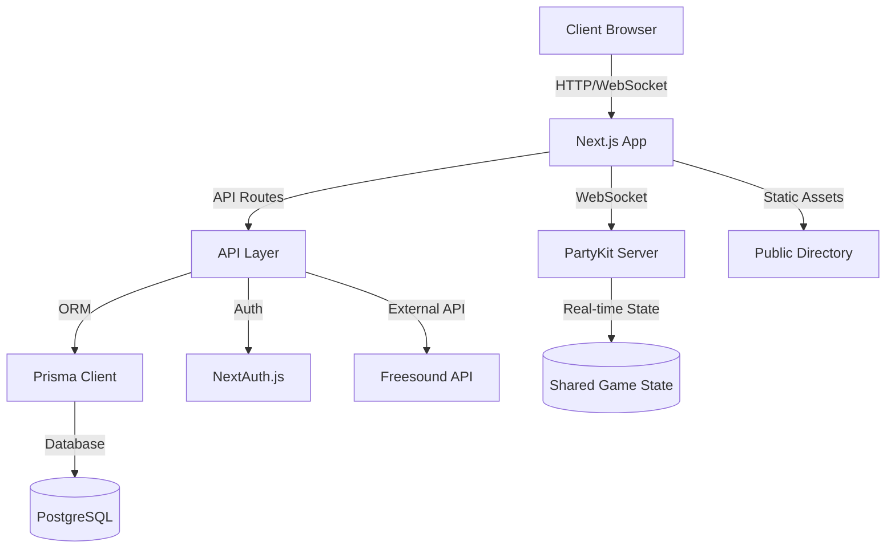

## 🐉 Dungeon Master's Digital Grimoire

A powerful digital tome for Dungeon Masters and adventurers alike, crafted with modern web technologies to enhance your tabletop experience.

## 🏰 Core Features

### 🎲 Game Board System

- **Arcane Grid System**: Interactive game board with drag-and-drop tokens powered by WebSocket magic
- **Scrying Controls**: Dynamic zoom and pan capabilities for battlefield mastery
- **Fog of War**: Advanced visibility system with customizable brush controls
- **Real-time Scrying**: Token positions update instantly via WebSocket enchantments
- **Cartography**: Dynamic background image support for custom maps
- **Portal View**: Immersive fullscreen mode

### 🎭 Token Mastery

- **Diverse Entities**: Support for heroes, villains, and neutral beings
- **Vitality Tracking**: Real-time hit point monitoring and management
- **Summoning**: Token duplication for swift enemy deployment
- **Transmutation**: Convert tokens between different entity types
- **Command Menu**: Context-based actions for token manipulation
- **Size Variants**: Customizable token dimensions for creatures of all sizes
- **Health Visualization**: Dynamic health bars and status indicators
- **Visibility Controls**: Public/private token information management

### 🎵 Soundcraft System

- **Sound Libraries**: Organized collections of atmospheric sounds
- **MIDI Integration**: Hardware MIDI controller support
- **Volume Control**: Individual sound effect volume management
- **Effect Favorites**: Quick access to frequently used sounds
- **Real-time Playback**: Simultaneous multiple sound effect support
- **Sound Categories**: Organized effect management by type
- **Custom Libraries**: Create and manage personal sound collections

### 💡 Light Control System

- **RGB Control**: Full color spectrum management
- **Preset Scenes**: Save and recall lighting configurations
- **Brightness Control**: Granular intensity adjustments
- **Effect Synchronization**: Coordinate lights with sound effects
- **Multiple Device Support**: Control various light types
- **Scene Transitions**: Smooth lighting changes

### ⚔️ Character Forge

- **Hero Creation**: Comprehensive character building system
- **Attribute Mastery**: Advanced ability scores calculation
- **Treasury**: Equipment and inventory management
- **Training Grounds**: Skills and proficiencies system
- **Divine Protection**: Saving throws implementation
- **Moral Compass**: Character alignment framework
- **Origin Stories**: Rich background selection system
- **Character Quiz**: Guided character creation through personality questions

### 🗡️ Equipment Arsenal

- **Weapon Mastery**: Comprehensive weapon database
- **Armor Collection**: Detailed armor system with statistics
- **Price Management**: Equipment cost tracking
- **Damage Systems**: Weapon damage type and dice calculations
- **Equipment Categories**: Organized gear management
- **Custom Equipment**: Add personal items and gear

### 🐲 Monster Grimoire

- **Bestiary**: Extensive monster catalog with filtering
- **Combat Stats**: Detailed monster attributes and abilities
- **Challenge Ratings**: Advanced difficulty scaling system
- **Special Actions**: Support for unique abilities and reactions
- **Legendary Beings**: Implementation of legendary actions
- **Scroll Creation**: Thermal printing integration for monster stats
- **Monster Search**: Quick creature lookup and filtering
- **Stat Blocks**: Beautifully formatted monster information

### 📜 Campaign Chronicles

- **Quest Logs**: Session creation and management
- **Scribe's Notes**: Integrated session documentation
- **Time Keeper**: Game calendar integration
- **Party Roster**: Comprehensive player management
- **Session Switching**: Quick navigation between game sessions
- **Campaign Settings**: Customizable game parameters

### 🔐 Authentication System

- **User Accounts**: Secure account creation and management
- **Role-based Access**: DM and player permission levels
- **Session Security**: Protected game access
- **Profile Management**: User settings and preferences
- **Data Persistence**: Save character and campaign progress

## 🏗️ Architecture



## 🚀 Development Setup

### Prerequisites

- Node.js 18.x or higher
- PostgreSQL 14.x or higher
- MIDI controller (optional, for sound features)
- Thermal printer (optional, for monster stat blocks)

### Project Structure

```
├── app/                    # Next.js 13+ app directory
│   ├── api/               # API routes
│   ├── components/        # Shared components
│   ├── game/             # Game-related components
│   ├── hooks/            # Custom React hooks
│   └── services/         # External service integrations
├── lib/                   # Utility functions
├── party/                # PartyKit real-time server
├── prisma/               # Database schema and migrations
└── public/               # Static assets
```

## 🧙‍♂️ Technical Enchantments

### ⚡ Real-time Collaboration

- **Telepathic Link**: WebSocket integration via PartyKit
- **Shared Visions**: Synchronized view state management
- **Realm Privacy**: Public/private view modes with role-based access
- **State Management**: Real-time game state synchronization

### 🎨 Interface Mastery

- **Adaptive Scrolls**: Responsive design for all device sizes
- **Spell Windows**: Modal systems for forms and menus
- **Guidance Runes**: Comprehensive tooltips and help system
- **Command Center**: Intuitive control layout
- **Dark Mode**: Eye-friendly interface option
- **Custom Themes**: Personalized color schemes

### 📚 Knowledge Repository

- **Prismatic Database**: Prisma ORM integration with PostgreSQL
- **Monster Capture**: Automated data scraping and storage
- **Hero Archives**: Persistent character data management
- **Memory Crystals**: Efficient session state management
- **Data Migration**: Seamless database updates
- **Caching**: Optimized data retrieval

### 🎯 Developer Arsenal

- **TypeScript**: Type-safe spell casting
- **Next.js 13+**: App router and server components
- **Tailwind CSS**: Enchanted styling system
- **Prisma**: Database sorcery
- **PartyKit**: Real-time collaboration magic
- **NextAuth.js**: Security wards
- **WebSocket**: Real-time communication
- **API Integration**: External service connectivity

### 🛠️ Development Setup

```bash
# Clone the repository
git clone https://github.com/yourusername/dungeon-dragon.git
cd dungeon-dragon

# Install dependencies
npm install

# Setup environment variables
cp .env.example .env
# Edit .env with your configuration

# Setup database
npx prisma generate     # Generate Prisma Client

# Start development servers
npm run dev            # Next.js development server
npm run party:dev      # PartyKit WebSocket server

# Development Tools
npx prisma studio     # Database management interface
npm run lint         # Run ESLint
```

### 💻 Development Workflow

1. **Database Changes**

   ```bash
   npx prisma migrate dev --name description_of_change
   ```

2. **API Development**

   - Add routes in `app/api/`
   - Use Prisma Client in `prisma/db.ts`
   - Test with API routes at `http://localhost:3000/api/`

3. **Real-time Features**

   - Modify PartyKit server in `party/index.ts`
   - Test WebSocket connections in browser console
   - Monitor PartyKit logs during development

4. **Component Development**
   - Follow Next.js 13+ conventions
   - Use server components by default
   - Add client components with 'use client' directive
